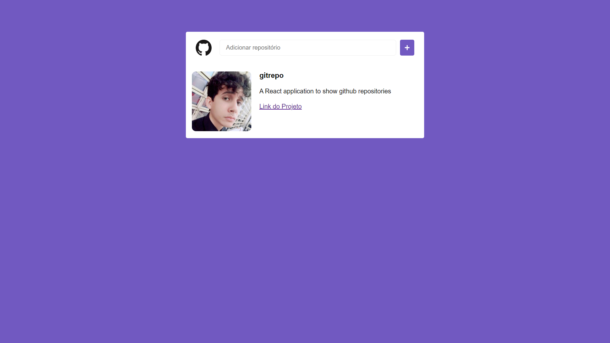

<h1 align="center">
  
<br>
GitRepo
</h1>

<p align="center"> A React application to show github repositories

## Features
To create that web application was used:

- ⚛️ **React Js** — JavaScript lib to create interfaces

## Project

A simple application to show informations about a Github repository through the Github's API.

## Getting started

###  Frontend
Follow the steps below to start the application:
```bash
yarn install
yarn start
```

## Licença

This project is licenced by MIT License - Go to the [licençe page](https://opensource.org/licenses/MIT) to see more details.
